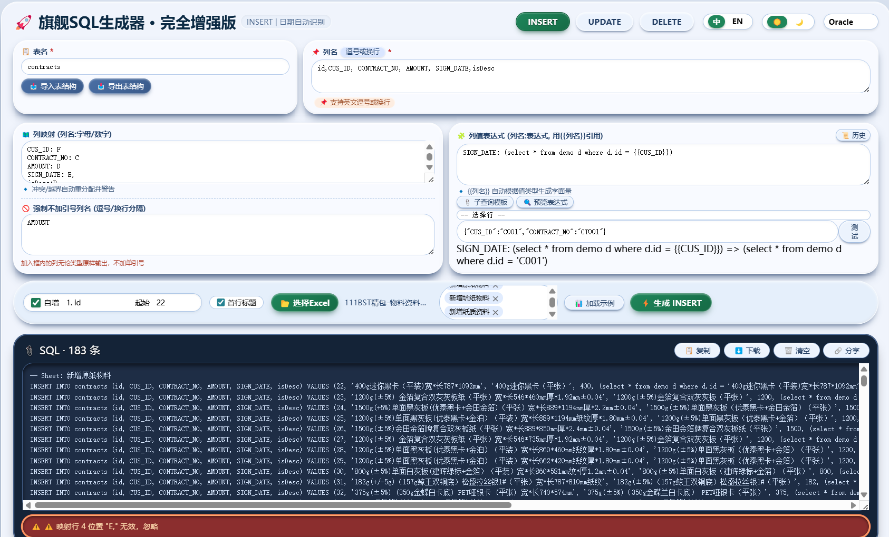
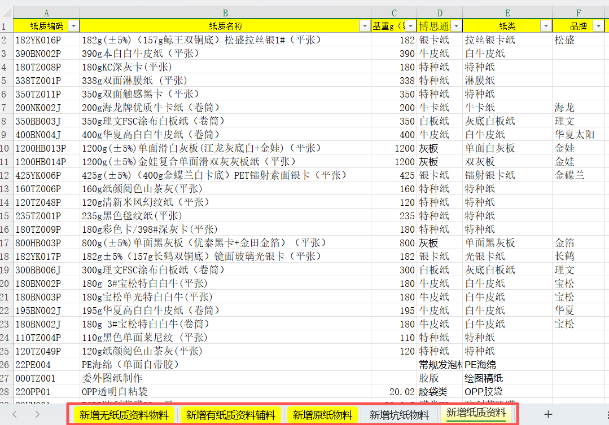

# sql-excel-tool

#### 介绍
Excel转SQL语句生成器‌
‌功能描述‌：此工具能够快速将Excel表格中的数据转换为可直接执行的SQL语句。‌
‌主要应用‌：适用于需要将Excel中的批量数据导入数据库的场景。用户只需上传Excel文件中的表头与数据，即可生成对应的INSERT、UPDATE、DELETE语句。‌
‌高级特性‌：支持自定义目标表名与主键字段，并提供数据预览功能以确保转换准确性。‌

#### 使用说明

====
excel工作表批量导入

#### 参与贡献

1.  Fork 本仓库
2.  新建 Feat_xxx 分支
3.  提交代码
4.  新建 Pull Request

#### 特技

1.  使用 Readme\_XXX.md 来支持不同的语言，例如 Readme\_en.md, Readme\_zh.md
2.  Gitee 官方博客 [blog.gitee.com](https://blog.gitee.com)
3.  你可以 [https://gitee.com/explore](https://gitee.com/explore) 这个地址来了解 Gitee 上的优秀开源项目
4.  [GVP](https://gitee.com/gvp) 全称是 Gitee 最有价值开源项目，是综合评定出的优秀开源项目
5.  Gitee 官方提供的使用手册 [https://gitee.com/help](https://gitee.com/help)

6.  Gitee 封面人物是一档用来展示 Gitee 会员风采的栏目 [https://gitee.com/gitee-stars/](https://gitee.com/gitee-stars/)

